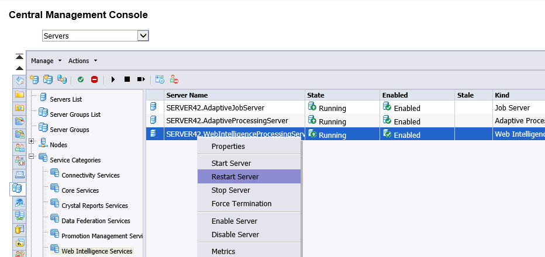

# Installation & Configuration

1. Download the sample
1. Copy the Custom Data Access Driver plug-ins to the Data Access folder of your SAP BI platform server
1. Deploy the content using the Promotion Management in the Central Management Console
1. Test the sample Web Intelligence document and universe

### Table of Contents  
[Preparation](#prepare)  
[Install plug-ins](#install)  
[Deploy content](#deploy)  
[Test content - Web Intelligence](#test-webi)    
[Test content - Universe](#test-unv)  

<a name='prepare'>  

## Preparation  
1. Clone or download the sample project.  
1. If you download the ZIP, please extract the files.   
1. Use the files from folder `..\deploy` in the next steps.

<a name='install'>  

## Install plug-ins  
1. Copy the Custom Data Access plug-ins to your system  
   **Source**:  `<your folder>\deploy\install\SAP BusinessObjects Enterprise XI 4.0\dataAccess`  
   **Target**: `<BOE folder>\SAP BusinessObjects Enterprise XI 4.0\dataAccess`  
   
   
 1. Check the target folder for JAR files  
   
 
 1. Open the CMC and restart the Web Intelligence Process server for changes to take effect  
   
 
 
<a name='deploy'>  

## Deploy content
1. Open the CMC  
1. Select Promotion Management  
  
1. Select Menu &gt; Import &gt; Import file - choose Browse  
  

1. Select the sample content file (LCMBIAR) - choose Open - choose Ok  
  

1. Enter your System as Destination - choose Create  
  

1. Select Menu &gt; Promote - choose Promote  
  

1. Select the Job in the list - choose Menu &gt; History  
The status should be success  
  

<a name='test-webi'>  

## Test content - Web Intelligence

1. Open the BI Launchpad  

1. Select Documents - Folders - SAP Samples - BI on BI  

1. View Document `Custom Data Access - Sample- Tutorial Results`  

1. Refresh the Document  
Column No and Text will show the results of the tutorial table.  

<a name='test-unv'>  

## Test content - Universe

1. Open the Information Design Tool  

1. Create a new Project: BI on BI - sample  

1. Connect to your Repository  

1. Retrieve the sample universe - Select Local Project: BI on BI - sample  

1. Check the Business Layer and Data Foundation  
Contains the `Tutorial Results` Objects and Table  

1. Check the Queries  
Contains the Query `Test-Sample`

1. Choose Execute Query to show the results  

