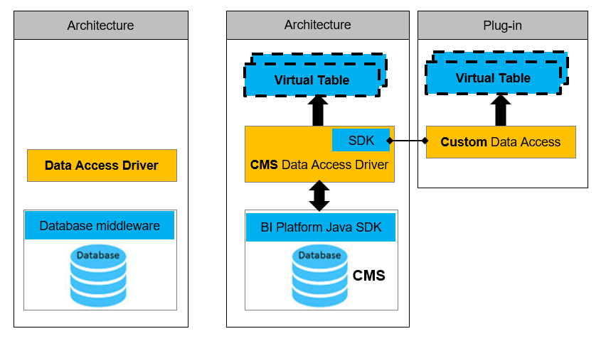

# CMS Data Access Driver - Architecture & SDK

The CMS Data Access Driver is developed using the [SAP BusinessObjects Data Access Driver Java SDK](https://help.sap.com/viewer/e4714085097d44d08bc9b3f37a460bff/4.2.3/en-US/b705a3c3eb7a4604a92e0f043db471df.html)

The diagram below shows details of Data Access Driver architecture.  
  
Instead of a Database middleware, the CMS Driver is using the BI Platform SDK and CMS queries to retrieve the data.
Virtual Tables are provided and can be used in the Data Foundation of a universe.

Next: [Develop with the Help of Samples - What is needed](../Develop/README.md)  