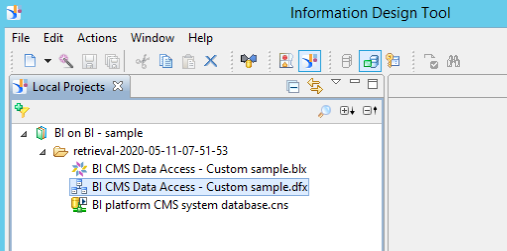

# Develop with the Help of Samples - What is needed

This tutorial describes the development environment. You will learn **What** is needed to
* develop a Java plugin
* define a Universe

## Table of Contents
[Use Java samples](#useJav)  
[Use Universe sample](#useUnv)

<a name='useJava'>

## Use Java samples

### Procedure
1. Launch your Eclipse IDE
1. Import the sample projects
1. Configure Build Path - Classpath Variables
1. View the sample Plugin Java source code

### Import the sample projects
1. Use Import in your Eclipse IDE, select `Existing Projects into Workspace`
  
1. Select the downloaded ZIP and click Finish
  
1. The sample projects will be imported and show errors (resolved in the next steps)
  

### Configure Build Path - Classpath Variables
To solve the errors, we will configure a new Classpath Variable.  
1. In the menu bar, click **Window > Preferences**, enter `build` in the search field and click on **Classpath Variables**
  
1. Click on **New...** and define the Variable values  
Name: **BOE_HOME**  
Path: **\<BOE folder\>\SAP BusinessObjects Enterprise XI 4.0** from your installation  
  
1. Click **Apply and Close** on the Preferences dialog, project should show no errors

### View the sample Plugin Java source code
You can review the source code of the samples in your Eclipse IDE.

 
<a name='useUnv'>

## Use Universe sample
The universe is already available on your system when you followed the steps of [Installation & Configuration](../../README.md#installation)

### Procedure
1. Launch the Information Design Tool
1. Open the sample project
1. View the sample Universe

### Open the sample project

### View the sample Universe
You can review the Data Foundation and Business Layer in the Information Design Tool.

Next: [First sample plugin - How to develop](../Sample%20Plugin/README.md)  

