# Sample Plugin - How to develop

This tutorial describes the development steps using the provided sample. You will learn from the
* Java source code - How to create a virtual table, deploy and install a plugin
* Universe - How to use a virtual table in Data Foundation and Business Layer

## Table of Contents
[Overview](#overview)  
[Create a virtual table](#java)  
[Use a virtual table](#unv)

<a name='overview'>

## Overview
With a virtual table you can link additional data to result rows. The CMS Data Access Driver:
* executes the Universe Query
* prepares a result set and a list of InfoObject IDs
* connects to your plugin 
* for each ID, you can add columns / rows to the result set 

In the sample we will use a simple query of the CMS universe to get ID and Name of InfoObjects.  
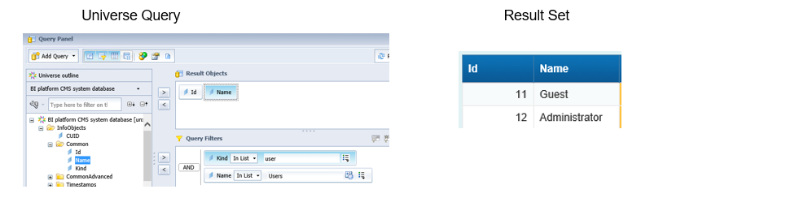

In the plugin we have implemented a virtual table which has two columns`'No` and `Text`. The columns are filled with the value for `ID` and `ID: text tutorial`.  
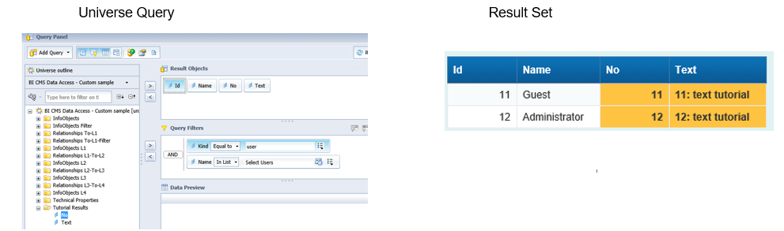

<a name='java'>

## 1. Create a virtual table
Eclipse project: `sap.sample.cmsdbdriver.plugin`

**Procedure**
1. Virtual Table Class
1. Plugin Class
1. Create JAR File
1. Install Plugin

### 1.1 Virtual Table Class
Source: `TemplateTableResults.java`
To create a virtual table in your Java code, you will extend `IResultTable` and implement `IUnvTable`.
```java
public class TemplateTableResults extends IResultTable implements IUnvTable {

	private static final String TABLE_NAME = "Tutorial_Results";
```

#### 1.1.1 Define the table columns
To define the table columns, we are adding `UnvTableFieldDef` Objects to a Map. Each column has a name and a type defined  in `java.sql.Types`.

```java
	private static final String NO = "no";
	private static final String TEXT = "text";
	
	final private Map<String, UnvTableFieldDef> columns = new HashMap<String, UnvTableFieldDef>();

	public TemplateTableResults(IResultPlugin plugin) {
		super(plugin);
		columns.put(NO, new UnvTableFieldDef(NO, Types.INTEGER));
		columns.put(TEXT, new UnvTableFieldDef(TEXT, Types.VARCHAR));
	}
```

#### 1.1.2 Return table name and columns
We have to implement the methods to return the table name and the table columns from our Map.
```java
	@Override
	public String getName() {
		return TABLE_NAME;
	}

	@Override
	public Map<String, UnvTableFieldDef> getTableFields() {
		return this.columns;
	}
```

#### 1.1.3 Initialize your data
When the CMS Data Access Driver has prepared the result set with the IDs, this method will be called. You can use this to prepare your additional data before `setValues()` is called for each Id. E.g. execute another CMS query or any other initialization needed for your data preparation.
Useful methods can be `getQueryElement()` or `getIds()`.
```java
	@Override
	public void initialize() {
		// nothing to initialize/prepare
	}
```

#### 1.1.4 Add your data
The method will be called for each id of the result set. We are setting the value for each column. The method addRow() will add the values to the result set and insert a new row if needed.

```java
	@Override
	public void setValues(int id) throws CMSDBDriverException {
		setObjectProperty(TABLE_NAME + "." + TemplateTableResults.NO,
				Integer.class.getName(), id);
		setObjectProperty(TABLE_NAME + "." + TemplateTableResults.TEXT,
				String.class.getName(), id + ": text");
		addRow(id);
	}
```

### 1.2. Plugin Class
Source: `Plugin.java`
To create a plugin in your Java code, you will extend `IPlugin`. With this definition the CMS Data Access Driver will recognize that there is an additional plugin available and can be used.
```java
public class Plugin implements IPlugin {
```

#### 1.2.1 Add virtual table(s)
Using the Helper class `PluginBase` it is very easy to add virtual tables to your plugin. You can add several virtual tables to one plugin.
```java
    private final PluginBase pluginBase;

    public Plugin(final CMSDriverConnection connection) {  
    	pluginBase = new PluginBase(connection);
    	pluginBase.addTable(new TemplateTableResults(pluginBase));
    }
```

#### 1.2.2 Return Id, DetailsProvider and Tables
We have to implement the methods to return the plugin Id, DetailsProvider and Tables.
```java
	@Override
	public IDetailsProvider getDetailsProvider() {
		return pluginBase.getDetailsProvider();
	}

	@Override
	public String getId() {
		return Plugin.class.getName();
	}

	@Override
	public List<IUnvTable> getTables() {
		return pluginBase.getTables();
	}
```

### 1.3. Create JAR File
The plugin project must be exported to a JAR file. You can use the export in the Eclipse IDE or the project coming with the sample.
Eclipse project: `sap.sample.deploy`

#### 1.3.1 Export JAR
File: `JAR-export-SamplePlugin.jardesc`  
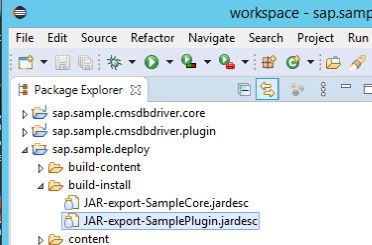<br />  
Double click or Open the file and select Finish.  
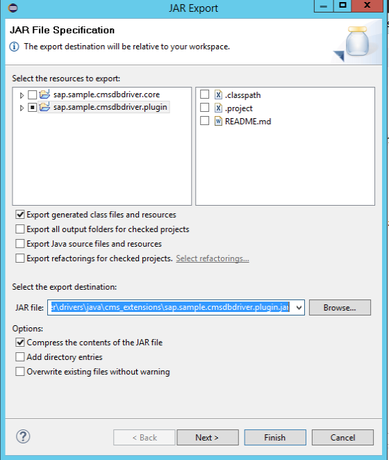<br />  
The JAR file will be generated in subfolder `install` of the Eclipse project.
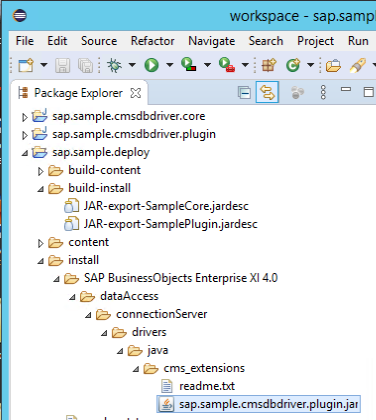<br />

### 1.4 Install Plugin
To use the plugin with the CMS Data Access Driver you must copy the JAR to your system:  
**Target**: `<BOE folder>\SAP BusinessObjects Enterprise XI 4.0\dataAccess`
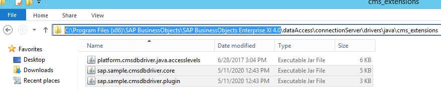 


<a name='unv'>

## 2. Use a virtual table
Information Design Tool project: `BI on BI - sample`  
The sample universe was created as Linked Universe on the `BI platform CMS system database.unx` from Universe Folder - BI on BI.

**Procedure**
1. Data Foundation
1. Business Layer
1. Queries

### 2.1 Data Foundation

#### 2.1.1 Connection
The `virtual tables` available with the CMS Data Access Driver are displayed in the Connection View. With the sample plugin we have added the table `Tutorial_Results`.    
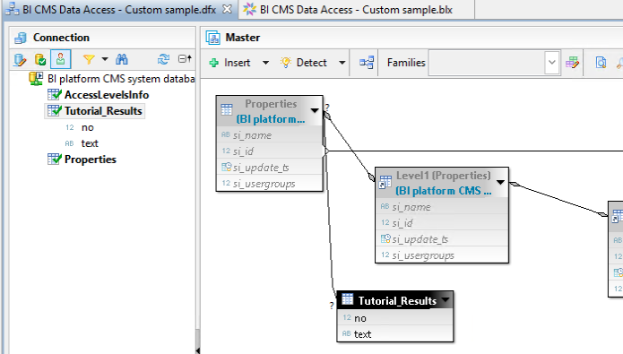

### 2.1.2 Join with table Properties
For the virtual table you must define a Join with the table `Properties`. In the Join expression you must use the column name **`join`** for both tables (definition from CMS Data Access Driver).  
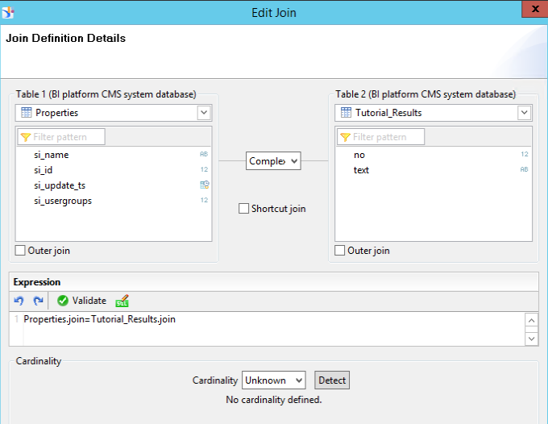

### 2.2 Business Layer
To use the table columns in Queries, you have to define Universe Objects in the Business Layer.
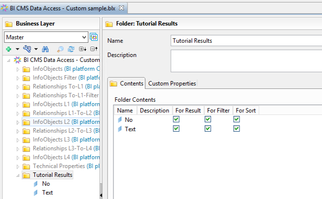


### 2.3 Queries
You can test the new Objects in a Universe Query
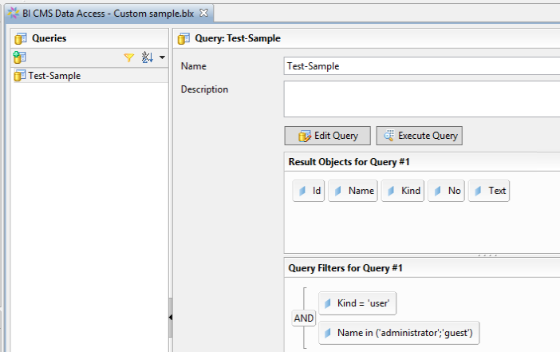<br/>

and check the Results  
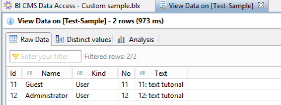

Next: [Reporting and Analysis - How to use](../Use/README.md)   


