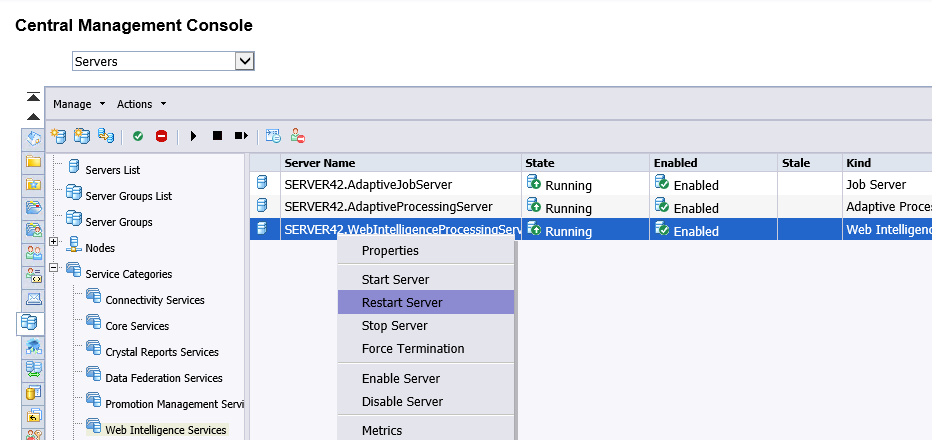
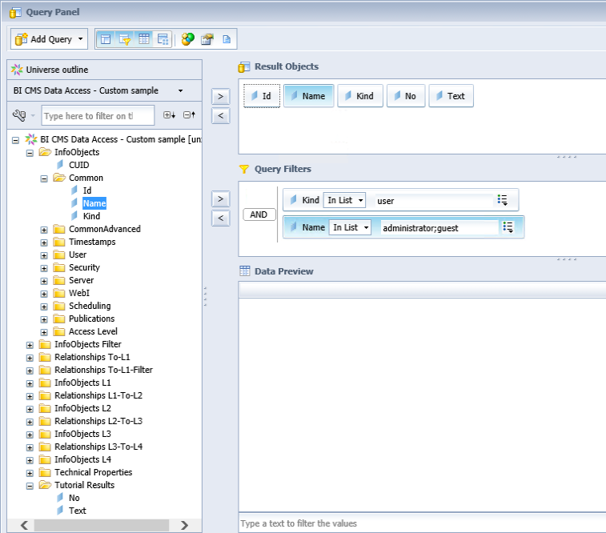
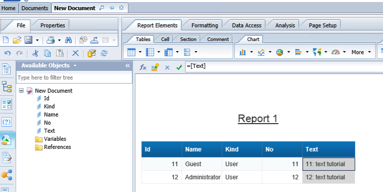

# Reporting and Analysis - How to use

Now we have developed a plugin and the universe, let's use it. You will see **How** to
* activate a CMS Data Access Driver plugin 
* use the universe in Web Intelligence

## Requirements
* you have tested the plugin in a universe query, see [Use a virtual table](../Sample%20Plugin/README.md#unv) from tutorial *Sample Plugin - How to develop*
* you have published the universe to the repository

## Activate a CMS Data Access Driver plugin  
To avtivate the plugin (new/updated JAR), open the CMC and restart the Web Intelligence Process server for changes to take effect (see [Install plug-ins](../../deploy/README.md#install))     
 
   
## Use the universe in Web Intelligence  
You can test the universe in BI Launchpad using the provided sample document (see [Test content - Web Intelligence](../../deploy/README.md#test-webi)) or create a new document.

1. Open the BI Launchpad
1. Select Web Intelligence
1. Create a Document
1. Select data source - Universe
1. Select the universe from the list
1. Select Objects from the core universe, your virtual table and define your Query Filters
 
1. Run the Query and check the results
 

